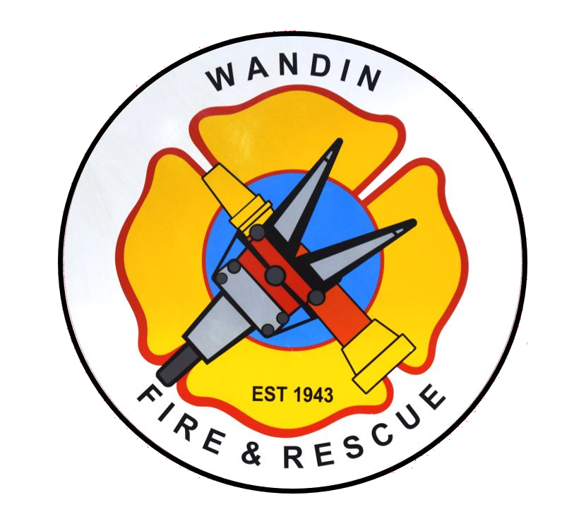
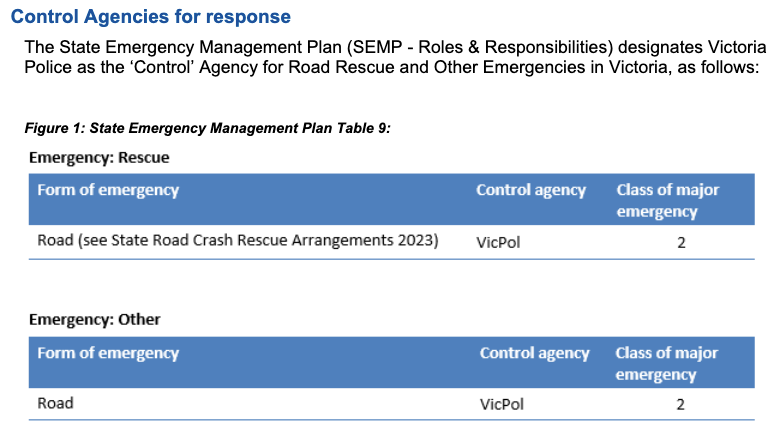
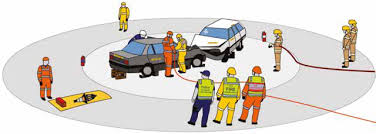

<!-- _paginate: skip -->
<!-- _header: '' -->
<!-- _class: centered -->

## Wandin Rescue 2025

# RCR Awareness

### THIS PRESENTATION DOES NOT CONTAIN GRAPHIC MATERIAL

https://wandincfa.com.au/rcr101

---

# Overview

- Introductions
- Legal Stuff
- Fire Brigade Actions
- Rescue Actions
- Closing

<!--
- Welcome
- Thanks for having us
- Thanks for coming
- Administration: Rescue is still online. We will respond if paged.
- I can only speak to our policies and processes, not other organisations.
-->

---

# Wandin Rescue

- Brigade funded first Rescue vehicle in 1965.
  - Possibly the first Rescue Applicance in the state.
  - Replaced twice through community funding.
  - Current ‘Medium’ Rescue provided by CFA in 2011.
- Approximately 20 qualified Rescue Operators.
- Unit accreditation every 4 years.

---

# Road Crash Rescue Arrangements Victoria

- Governing policy for RCR in Victoria under EMV
  - CFA
  - FRV
  - SES
  - Independent providers (_Echuca Moama_ and _Shepparton_)
- Current version is December 2023

---

# Road Crash Rescue Arrangements Victoria

- Wandin is a _“Principal Rescue Provider”_
  - Pumper Rescues (eg, FRV) are _“Support Rescue Providers”_
- _Support Rescue Providers_ can only effect rescue:
  - For vehicle that is on its wheels; and
  - Where AV triage the patient as time-critical
- We are not a Fire Brigade
  - Ignore the CFA badges on our trucks and uniform.

---

# ANCAP Rescue App

Free app for IOS and Android provides First Responders with colour-coded illustrations highlighting the location of
vehicle features such as:

- Batteries (Low and High Voltage)
- Airbag inflators
- Seatbelt pre-tensioners
- Fuel tanks

<!--
We recommend every first responder downloads and has it available, even if no rescue is required.
-->

---

# Road Crash Rescue Arrangements Victoria

## Who's in charge at a road crash?

---

# Road Crash Rescue Arrangements Victoria

Establish IEMT with VicPol “Police Forward Command” (PFC).

<!--
- AV if possible – may have to wait for Health Commander.
- Police Forward Command (PFC)
  - Ask the VicPol members who is taking that role.
  - PFC may change as more senior members arrive (eg, Highway Patrol).
- We will focus on the extrication, especially if short crewed.
- We want the local brigade to manage overall scene, including taking on Incident Controller.
-->

---

# Road Crash Rescue Arrangements Victoria

## Role of other emergency service personnel:

> ...ensure safety of the area, appropriate access and egress for the RCR Principal Provider and Ambulance … for timely access to the patient.
>
> <small>_&mdash; Road Crash Rescue Arrangements 2023_</small>

---

# Does your brigade have any SOP for RCR incidents?

---

# Fire Appliance

- Park in fend-off position, 2 hose lengths away from scene.
- **Charged** line with crew.
- Maintain access for Ambulance and Rescue.

> An attended charged hose line capable of 360° movement around any vehicles with trapped patients; AND
> Have ready access to a dry chemical fire extinguisher
>
> <small>_&mdash; Road Crash Rescue Arrangements 2023_</small>

<!--
- Prefer a 38 over a live reel.
- What do you do if a fire starts?
  - Fire Brigage is now the combat agency.
  - Protect crews and patient.
  - Put fire out LAST.
-->

---

# Hazards

- Identify Hazards
- **What do you consider hazards?**
- Hierarchy of Control:
  - Eliminate
  - Reduce (_Substitute_ or _Isolate_)
  - Control
  - PPE/PPC

<!--
Discuss hazards:
fuel/oil, fire, batteries, power lines, dogs/animals, angry patients/bystanders, fallen trees, biological

All first responders should Double Glove.
-->

---

# Primary Search and Size Up

- Initial Scene Size Up
  - Inner search – within 5m of scene, including vehicles
  - Outer search – up to 30m
- DO NOT Disconnect Batteries
- Monitor Electric Vehicle (EV) Batteries with TIC

---

## First Aid

- If possible
- Make contact with patient and establish relationship

## Traffic Control

- Protect work zone
- Preserve access for Ambulance and Rescue

## Establish Action Zone

- Inner Work Area: 5m around each accident vehicle
- This is the space for charged line

---

# Scene Setup

---

# Incident Management

- Provide SitRep to FireComm for Ambulance and Rescue:
  - Patient Details
    - Number of Patients
    - Age, Sex, Breathing Status, and LOC
  - Mechanism of Impact
  - Method of Entrapment
  - Vehicle Type(s)
    - Especially for unusual/exotic or alternate fuel vehicles (EV or Hydrogen)

<!--
- Important to us for crew tasking and resource planning:
  - Do we need a second rescue?
  - Should we cancel our Rescue Support?
- Important to AV:
  - They may expedite HEMS response based on your assessment
-->

---

# Rescue Arrival

- Direct Rescue to reserved parking
- Ensure your OIC is clearly identified
- Provide briefing to Rescue Commander:
  - Situation and IEMT Introduction
  - Any tasks already completed
- Rescue Operators may go direct to accident vehicle(s) for extrication assessment and stabilisation

---

# Cancelling Rescue

- **Do not cancel rescue until _all patients are out of the vehicle_**

- Your patient may be out, but can paramedics get them to the ambulance?
- We may continue Code 3 at the discretion of the Rescue Commander

---

# Cancelling Rescue

> Only once it has been verified that all occupants have been safely removed from the vehicle, can the Police Commander and/or other ESO vehicles on-scene consider advising … RCR Providers are not required
>
> <small>_&mdash; Road Crash Rescue Arrangements 2023_</small>

Key phase that must be used is:

>	_all occupants are out of the vehicle(s)_

---

# Reasons to continue Rescue Response

- Medical Equipment & Crew:
  - First Aid _(upgrading to Trauma Kit in 2025)_
  - Resuscitation Equipment _(O2, Defib, etc)_
- EV Safety Plug
- Stabilisation of Vehicles for Scene Safety
- _“Moditech”_ for Vehicle Data
  - More comprehensive than ANCAP.

---

# Rescue Scene Setup

Rescue will create 3 zones:

- **Tool Pit** - _edge of work zone_
- **Debris Pit** - _outside work zone_
- **Personnel Area**- _rear of Rescue Truck_

Available Fire Brigade crew can stand in the Personnel Area to be tasked by Rescue Commander when additional hands are required.

<!--
- If you’re not comfortable, say something and we will reassign.
- Don’t say “yes” then not do it.
-->

---

# Systems Approach

- Stabilisation & Glass Management
- Initial Access & Patient Care
- Full Access & Extrication (PACE):
  - _Primary, Alternate, Contingency, Emergency_
- Makeup & Readiness

---

# Rescue Makeup

- Fire Brigades can assist makeup by helping return equipment to rescue vehicle
- We aim to make the appliance available again ASAP
- Beware of new hazards:
  - Biohazards
  - Removing stabilisation may destabilise vehicle
- **Ask and wait for direction if unsure**

---

# After Action Review

- We may conduct a short After Action Review (AAR) on-scene if possible
  - Not a full debrief, just a short semi-formal review of what happened etc
- Debrief may be conducted after returning to station.
- We welcome Fire Brigade to participate in AAR and Debriefs:
  - At your station or ours
  - Same day or another day
  - Talk to Rescue Commander if you would like to conduct debrief

---

# Critical Incident Stress

- CFA has a fantastic Peer Support Network.
- Available to all CFA members, and your family.
- Don’t forget CIS builds up over time.
  - It may be a minor incident that ‘_breaks the camels back_’

---

# Our Goal

## Positive Patient Outcomes

### We are here to help the patient _and_ you &mdash; use us!

---

# Questions?

https://wandincfa.com.au/rcr101

<!--
- Vehicle/Equipment Show'n'Tell:
  - Split into fire brigade members into smaller groups
  - Assign groups to other rescue crew
-->
