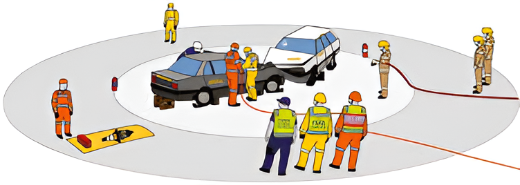

# RCR Awareness

Wandin Rescue 2024

_THIS PRESENTATION DOES NOT CONTAIN GRAPHIC MATERIAL_

https://wandincfa.com.au/rcr101

---

# Overview

- Introductions
- Legal Stuff
- Fire Brigade Actions
- Rescue Actions
- Closing

<!--
Welcome
Thanks for having us
Thanks for coming
Administration: Rescue is still online. We will respond if paged.
I can only speak to our policies and processes, not other organisations.
-->

---

# Wandin Rescue

Brigade funded first Rescue vehicle in 1965.

Replaced twice through community funding.

Current Mercedes Atego ‘Medium’ Rescue vehicle provided by CFA in 2011.

Approximately 20 qualified Rescue Operators.

Unit accreditation every 4yrs.

---

# Road Crash Rescue Arrangements Victoria

- Governing policy for RCR in Victoria under EMV
  - CFA
  - FRV
  - SES
  - 2 Independent providers (Echuca/Moama and Shepparton)
- Current version is 2023 (December)

---

# Road Crash Rescue Arrangements Victoria

- Wandin is a “Principal Rescue Provider”
  - Pumper Rescues (eg, FRV) are “Support Rescue Providers”.
- We are not a Fire Brigade
  - Ignore the CFA badges on our trucks and uniform.

<!--
“Support” Rescue Units are NOT to effect rescue unless AV triage the patient as time-critical.
-->

---

# Road Crash Rescue Arrangements Victoria

## Who's in charge at a road crash?

---

# Road Crash Rescue Arrangements Victoria

Liaise with their “Police Forward Command” (PFC).

<!--
Establish an IEMT with VicPol, CFA and Rescue.
AV if possible – may have to wait for Health Commander.

We will focus on the extrication, especially if short crewed.

We want the local brigade to manage overall scene, including taking on Incident Controller.

Police Forward Command (PFC)
Ask the VicPol members who is taking that role.
It may change as more senior members arrive (eg, Highway Patrol).
-->

---

# Road Crash Rescue Arrangements Victoria

## Role of other emergency service personnel:

“ensure safety of the area, appropriate access and egress for the RCR Principal Provider and Ambulance” … “for timely access to the patient”.

---

# Fire Brigade SOP

## Does your brigade have any SOP for RCR incidents?

---

# Fire Brigade Scene Setup

## Fire Appliance:
- Parked in fend-off position, 2 hose lengths away from scene.
- Charged line with crew.
- Allow ample room for ambulance and rescue.

> “An attended charged hose line capable of 360° movement around any vehicles with trapped patients”; AND
> “Have ready access to a dry chemical fire extinguisher”

!<--
Prefer a 38 over a live reel.

Quotes are from Road Crash Rescue Arrangements 2023

What do you do if a fire starts?
You’re now the control agency.
Protect crews and patient.
Put fire out LAST.
-->

---

# Fire Brigade Scene Setup

## Hazards
- Identify Hazards – DISCUSS: What do you consider hazards?
- SPADRA.

## First Aid (if possible)
- Make contact with patient and establish relationship.

## Traffic Control
- Protect work zone.
- Preserve access for ambulance and rescue.

## Establish Action Zone:
- Inner Work Area: 5m around each accident vehicle.

<!--
Discuss hazards:
fuel/oil, fire, batteries, power lines, dogs/animals, angry patients/bystanders, fallen trees, biological

SPADRA: Safe Person Approach, Dynamic Risk Assessment

All first responders should Double Glove.
-->

---

# Scene Setup

---

# ANCAP Rescue App

Rescue Sheets provides first responders with colour-coded illustrations highlighting the location of features such high-voltage batteries, fuel tanks, airbag inflators and seatbelt pre-tensioners.

<!--
Free app – scan the QR code to go to website.

We recommend every first responder downloads and has it available, even if no rescue is required.
-->

---

# Fire Brigade Scene Setup

## Conduct Primary Search:
- Initial Size-up.
- Inner search – within 5m of scene, including vehicles.
- Outer search – up to 30m.

## DO NOT Disconnect Batteries.

## Monitor EV Batteries with TIC.

---

# Incident Management

- Provide SitRep to FireComm for AV and Rescue.
  - Patient Details
    - Number of Patients
    - Age, Sex, Breathing, and LOC.
  - Mechanism of Impact
  - Method of Entrapment
  - Vehicle Type(s)
    - Especially for unusual/exotic or alternate fuel vehicles (EV/Hybrid, Hydrogen).

<!--
Important to us for crew tasking and resource planning:
Do we need a second rescue?
Should we cancel our Rescue Support?

Important to AV – they may expedite HEMS response based on your assessment.
-->

---

# Rescue Arrival

- Direct Rescue to designated parking.
- Ensure OIC is clearly identified so Rescue Commander can liaise.
  - Establish IEMT with VicPol.

---

# Rescue Arrival

- OIC provide briefing to Rescue Commander on situation and any tasks already completed.
- Additional Rescue Operators may go direct to ambulance and/or accident vehicle(s) to conduct our own assessment.

---

# Cancelling Rescue

- **Do not cancel rescue until all patients are out of the vehicle and in ambulance care.**
- Your patient may be out, but can paramedics get them to the ambulance?
- _We may continue Code 3 at the discretion of the Rescue Commander._

---

# Cancelling Rescue

> “Only once it has been verified that all occupants have been safely removed from the vehicle, can the Police Commander
> and/or other ESO vehicles on-scene consider advising … RCR Providers are not required”

Key phase that must be used is:

>	"all occupants are out of the vehicle(s)"

---

# Cancelling Rescue

## Other reasons to keep rescue coming:

- Medical
  - First Aid (upgrading to Trauma Kit in 2025)
  - Resuscitation Equipment
- EV Safety Plug
- Stabilisation of Vehicles for Scene Safety
- “Moditech” for Vehicle Data

---

# Rescue "Systems Approach"

- Stabilisation
- Glass Management
- Initial Access
- Extrication (PACE):
  - Primary
  - Alternate
  - Contingency
  - Emergency
- Patient Packaging
- Makeup
- Readiness

---

# Scene Setup - Rescue

Rescue will create 3 additional zones:

- Tool Pit
- Debris Pit
- Personnel Area

Available fire brigade crew can stand in the Personnel Area to be tasked when additional hands are required.

<!--
If you’re not comfortable, say something and we will reassign.

Don’t say “yes” then not do it instead.
-->

---

# Rescue Makeup

Fire Brigades can assist make-up by helping return equipment to rescue vehicle.

- We aim to make the appliance available again ASAP.

Beware of new hazards:

- Biohazards
- Removing stabilisation may destabilise vehicle.

---

# After Action Review

- We may conduct a short After Action Review (AAR) on-scene if possible.
- Debrief may be conducted after returning to station.
- We welcome Fire Brigade to participate:
  - At your station or ours.
  - Same day or another day.
  - Inform Rescue OIC if you would like to be conduct debrief.

---

# Critical Incident Stress

- CFA has a fantastic Peer Support Network.
- Available to all CFA members, and your family.
- Don’t forget CIS builds up over time.
  - It may be a minor incident that ‘breaks the camels back’

---

# Summary

Our goal is positive patient outcomes.

We are here to help you and help the patient.

Use us!

Questions?

<!--
Group Q&A Session

Next: Vehicle/Equipment:
Split into fire brigade members into smaller groups
Assign groups to other rescue crew.
-->
